  <picture>
    <source media="(max-width: 640px)" srcset="assets/banner-mobile.svg" />
    
  </picture>

  
  
  
  
  
  

  I build <b>efficient backend systems</b> and <b>production-grade AI experiences</b> — with a focus on performance, reliability, developer experience and high-impact delivery. 
  Currently leading Instahyre's flagship <b>2026 AI-powered job creation &amp; recommendation</b> beta and a team of <b>5 developers</b>.

<h2 align="center">⚡ Impact at a Glance</h2>

  <picture>
    <source media="(max-width: 640px)" srcset="assets/metrics-mobile.svg" />
    
  </picture>

<b>More experience highlights</b>

 

- **SDE-2 at Instahyre**, leading flagship AI-powered hiring systems that transform job creation, candidate matching and recruiter productivity.
- Building real-time AI recommendations over large candidate datasets — expanding relevant candidate pools by **40%** and improving relevancy by **30%**.
- Leading **5 developers** across feature delivery, blocker resolution, code/design reviews and technical direction.
- Launched a consultancy hiring suite that increased consultant retention by **30%+** and hiring speed by **20%**.
- Decoupled and modularized booking/scheduling flows — prevented duplicate bookings, cut slot-fetching wait time by **45%** and reduced cross-module bugs.
- Built dynamic, on-the-fly email templates, taking rollouts from ~30 hours to ~1 hour.
- Automated payouts, class scheduling and dashboard workflows at Relevel, saving **260+ person-hours/month** and improving attendance by **30%**.
- Delivered features end-to-end across backend APIs and UI to unblock timelines; onboarded and mentored engineers to raise team productivity.

<h2 align="center">🧰 Tech Stack</h2>

  <b>LANGUAGES</b> 
  
  
  
  
  
  

  <b>BACKEND</b> 
  
  
  
  
  
  

  <b>AI &AMP; AGENTS</b> 
  
  
  
  
  
  
  
  
  
  
  

  <b>DATA</b> 
  
  
  
  
  

  <b>CLOUD &AMP; DEVOPS</b> 
  
  
  
  
  
  
  

<h2 align="center">🚀 Featured Projects</h2>

  🤖 <b>AI Agents</b> 
  <a href="https://github.com/Kaushik-Paul/alex-agent" title="Multi-agent financial advisor with portfolio analysis and retirement planning"><b>Alex Agent</b></a> &nbsp;·&nbsp;
  <a href="https://github.com/Kaushik-Paul/AI-Twin" title="Advanced AI system that creates a digital twin of yourself"><b>AI Twin</b></a> &nbsp;·&nbsp;
  <a href="https://github.com/Kaushik-Paul/AI-Agentic-Coder" title="Agentic coder that creates, tests, uploads and deploys apps from requirements"><b>AI Agentic Coder</b></a> &nbsp;·&nbsp;
  <a href="https://github.com/Kaushik-Paul/Auto-AI-Agents-Creator" title="AI agents that collaborate to generate and refine ideas in parallel"><b>Auto AI Agents Creator</b></a> &nbsp;·&nbsp;
  <a href="https://github.com/Kaushik-Paul/Cyber-Security-Agent" title="LLM-first agent that analyzes Python code and produces structured vulnerability reports"><b>Cyber Security Agent</b></a> &nbsp;·&nbsp;
  <a href="https://github.com/Kaushik-Paul/Career-Conversation" title="Conversational AI assistant that represents your professional profile"><b>Career Conversation</b></a>

  📈 <b>AI for Finance</b> 
  <a href="https://github.com/Kaushik-Paul/Price-Is-Right" title="AI-powered deal and contract assistant using a fine-tuned LLM"><b>Price Is Right</b></a> &nbsp;·&nbsp;
  <a href="https://github.com/Kaushik-Paul/Stock-Picker" title="AI stock recommendation agent driven by the latest news"><b>Stock Picker</b></a> &nbsp;·&nbsp;
  <a href="https://github.com/Kaushik-Paul/Stock-Market-Portfolio-Manager" title="AI agents that analyze market trends and automate stock trades"><b>Stock Market Portfolio Manager</b></a>

  🧩 <b>AI Products</b> 
  <a href="https://github.com/Kaushik-Paul/Healthcare-Saas" title="AI-powered healthcare SaaS that helps clinicians transform consultation notes"><b>Healthcare SaaS</b></a> &nbsp;·&nbsp;
  <a href="https://github.com/Kaushik-Paul/Manga-Translator-OCR" title="Manga translator using AI and OCR"><b>Manga Translator OCR</b></a> &nbsp;·&nbsp;
  <a href="https://github.com/Kaushik-Paul/janitorai-voice-studio" title="Brings the power of TTS to JanitorAI"><b>JanitorAI Voice Studio</b></a>

  🛠️ <b>Tools &amp; Engineering</b> 
  <a href="https://github.com/Kaushik-Paul/Media-Toolbox" title="FFmpeg-powered video, audio and subtitle toolbox with AI features"><b>Media Toolbox</b></a> &nbsp;·&nbsp;
  <a href="https://github.com/Kaushik-Paul/Huggingface-File-Manager" title="Online file manager backed by a Hugging Face bucket"><b>Hugging Face File Manager</b></a> &nbsp;·&nbsp;
  <a href="https://github.com/Kaushik-Paul/Dlp-Video-Downloader" title="Video downloader using yt-dlp and session cookies"><b>DLP Video Downloader</b></a> &nbsp;·&nbsp;
  <a href="https://github.com/Kaushik-Paul/Grokking-Low-Level-Design" title="Low-level system design implementations with detailed requirements"><b>Grokking Low Level Design</b></a>

Hover a project for a one-line summary · more at <a href="https://projects.kaushikpaul.co.in/">projects.kaushikpaul.co.in</a>

<h2 align="center">📊 GitHub Stats</h2>

  
  
  

  

  <picture>
    <source media="(prefers-color-scheme: dark)" srcset="https://raw.githubusercontent.com/Kaushik-Paul/Kaushik-Paul/output/profile-night-rainbow.svg" />
    <source media="(prefers-color-scheme: light)" srcset="https://raw.githubusercontent.com/Kaushik-Paul/Kaushik-Paul/output/profile-season.svg" />
    
  </picture>

<h2 align="center">🏆 Achievements &amp; Certifications</h2>

  <b>Kudos Award</b> — Instahyre, for consistent delivery &amp; quality 
  <b>AWS Certified AI Practitioner</b> — Early Adopter (2024–2027) 
  <b>Relevel Achiever</b> (2022) 
  <b>NPTEL</b> — Programming in Java (Gold) · Problem Solving Through C (Silver)

<h2 align="center">🤝 Let's Connect</h2>

  Open to selective <b>Senior Software Engineer</b>, <b>Backend Engineer</b> and <b>Agentic AI</b> roles — 
  especially high-impact backend systems, scalable APIs and intelligent agent platforms.

  📫 <a href="mailto:contact@kaushikpaul.co.in">contact@kaushikpaul.co.in</a> &nbsp;·&nbsp;
  💼 <a href="https://www.linkedin.com/in/kaushik-paul-767590215">LinkedIn</a> &nbsp;·&nbsp;
  🌐 <a href="https://www.kaushikpaul.co.in/">kaushikpaul.co.in</a>

Want a quick walkthrough of any project? Open an issue or reach out on LinkedIn.

