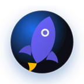

  

    

      
    

    

      <h1 style="margin:0;">Hi, I'm Kaushik Paul 👋</h1>
      
SDE-2 @ Instahyre • Backend Systems & AI Agents Developer

      

        <a href="https://www.kaushikpaul.co.in/">Website</a> ·
        <a href="https://projects.kaushikpaul.co.in/">Projects Hub</a> ·
        <a href="https://www.linkedin.com/in/kaushik-paul-767590215">LinkedIn</a>
      

      

        
      

    

  

---

<h2 align="center">About</h2>

  I'm an SDE-2 at Instahyre, building efficient backend systems and production-grade AI experiences. I focus on performance, reliability, developer experience, and high-impact product delivery.
  
- **Current focus:** Leading Instahyre's flagship **2026 AI-powered job creation & recommendation** beta.
- **AI impact:** Reduced job creation time by **65%** and improved candidate relevancy by **45%** through richer job intelligence and matching signals.
- **Impact-driven:** Optimized critical APIs up to **73% faster** and improved system reliability.
- **Systems thinking:** Modularized scheduling flows, cutting wait times by **45%** and reducing cross-module bugs.
- **Leadership:** Leading **5 developers** across feature delivery, blocker resolution, code/design reviews, and technical direction.
- **High-leverage outcomes:** Launched a major hiring-suite release increasing consultant retention by **30%+** and hiring speed by **20%**.
- **Developer velocity:** Built dynamic email templating to ship features **30× faster**.
- **End-to-end delivery:** Delivered features across backend APIs and UI when needed to unblock timelines.
- **Mentorship:** Onboarded and mentored engineers to raise team productivity.
  
---

<h2 align="center">Tech Stack</h2>

<h3 align="center">Languages</h3>

  
  
  
  
  
  

<h3 align="center">Backend & Frameworks</h3>

  
  
  
  
  
  

<h3 align="center">AI & Agents</h3>

  
  
  
  
  
  
  
  
  
  
  

<h3 align="center">Data & Storage</h3>

  
  
  
  
  

<h3 align="center">Cloud & Infrastructure</h3>

  
  
  
  
  
  
  

---

<h2 align="center">Experience Highlights</h2>

- **SDE-2 at Instahyre**, leading flagship AI-powered hiring systems that transform job creation, candidate matching, and recruiter productivity.
- Reduced job creation time by **65%** and improved candidate relevancy by **45%** in Instahyre's flagship 2026 beta.
- Building real-time AI recommendations over large candidate datasets to expand relevant candidate pools by **40%** and improve relevancy by **30%**.
- Resolved **1000+** tickets, including high-priority P0/P1 bugs, and shipped critical features stabilizing recruiter workflows.
- Launched a consultancy hiring suite that increased retention by **30%+** and improved hiring speed by **20%**.
- Decoupled booking modules, prevented duplicate bookings, and reduced slot-fetching wait time by **45%**.
- Built dynamic, on-the-fly email templates to accelerate rollouts from ~30 hours to ~1 hour.
- Automated payouts, class scheduling, and dashboard workflows at Relevel, saving **260+ person-hours/month** and improving attendance by **30%**.

---

<h2 align="center">Achievements & Certifications</h2>

- **Kudos Award** — Recognized at Instahyre for consistent delivery and quality.
- **AWS Certified AI Practitioner — Early Adopter (2024–2027)**
- **Relevel Achiever (2022)**
- **NPTEL:** Programming in Java (Gold), Problem Solving Through C (Silver)

---

<h2 align="center">GitHub Stats</h2>

  
  
  

<h3 align="center">Pinned Repositories</h3>

<table align="center">
  <tr>
    <td width="50%" valign="top">
      <h4><a href="https://github.com/Kaushik-Paul/Price-Is-Right">📦 Price-Is-Right</a></h4>
      
AI-powered deal and contract assistant using a fine-tuned LLM

      
      
      
    </td>
    <td width="50%" valign="top">
      <h4><a href="https://github.com/Kaushik-Paul/alex-agent">📦 alex-agent</a></h4>
      
Multi-agent financial advisor with portfolio analysis and retirement planning

      
      
      
    </td>
  </tr>
  <tr>
    <td width="50%" valign="top">
      <h4><a href="https://github.com/Kaushik-Paul/AI-Twin">📦 AI-Twin</a></h4>
      
Advanced AI system that creates a digital twin of yourself

      
      
      
    </td>
    <td width="50%" valign="top">
      <h4><a href="https://github.com/Kaushik-Paul/Manga-Translator-OCR">📦 Manga-Translator-OCR</a></h4>
      
Manga translator using AI and OCR

      
      
      
    </td>
  </tr>
  <tr>
    <td width="50%" valign="top">
      <h4><a href="https://github.com/Kaushik-Paul/janitorai-voice-studio">📦 janitorai-voice-studio</a></h4>
      
Brings the power of TTS to JanitorAI

      
      
      
    </td>
    <td width="50%" valign="top">
      <h4><a href="https://github.com/Kaushik-Paul/Media-Toolbox">📦 Media-Toolbox</a></h4>
      
FFmpeg-powered video, audio and subtitle toolbox with AI features

      
      
      
    </td>
  </tr>
  <tr>
    <td width="50%" valign="top">
      <h4><a href="https://github.com/Kaushik-Paul/Huggingface-File-Manager">📦 Huggingface-File-Manager</a></h4>
      
Online file manager backed by a Hugging Face bucket

      
      
      
    </td>
    <td width="50%" valign="top">
      <h4><a href="https://github.com/Kaushik-Paul/Dlp-Video-Downloader">📦 Dlp-Video-Downloader</a></h4>
      
Video downloader using yt-dlp and session cookies

      
      
      
    </td>
  </tr>
  <tr>
    <td width="50%" valign="top">
      <h4><a href="https://github.com/Kaushik-Paul/Cyber-Security-Agent">📦 Cyber-Security-Agent</a></h4>
      
LLM-first agent that analyzes Python code and produces structured vulnerability reports

      
      
      
    </td>
    <td width="50%" valign="top">
      <h4><a href="https://github.com/Kaushik-Paul/Healthcare-Saas">📦 Healthcare-Saas</a></h4>
      
AI-powered healthcare SaaS that helps clinicians transform consultation notes

      
      
      
    </td>
  </tr>
  <tr>
    <td width="50%" valign="top">
      <h4><a href="https://github.com/Kaushik-Paul/Auto-AI-Agents-Creator">📦 Auto-AI-Agents-Creator</a></h4>
      
AI agents that collaborate to generate and refine ideas in parallel

      
      
      
    </td>
    <td width="50%" valign="top">
      <h4><a href="https://github.com/Kaushik-Paul/AI-Agentic-Coder">📦 AI-Agentic-Coder</a></h4>
      
Agentic coder that creates, tests, uploads and deploys apps from requirements

      
      
      
    </td>
  </tr>
  <tr>
    <td width="50%" valign="top">
      <h4><a href="https://github.com/Kaushik-Paul/Stock-Picker">📦 Stock-Picker</a></h4>
      
AI stock recommendation agent driven by the latest news

      
      
      
    </td>
    <td width="50%" valign="top">
      <h4><a href="https://github.com/Kaushik-Paul/Grokking-Low-Level-Design">📦 Grokking-Low-Level-Design</a></h4>
      
Low-level system design implementations with detailed requirements

      
      
      
    </td>
  </tr>
  <tr>
    <td width="50%" valign="top">
      <h4><a href="https://github.com/Kaushik-Paul/Stock-Market-Portfolio-Manager">📦 Stock-Market-Portfolio-Manager</a></h4>
      
AI agents that analyze market trends and automate stock trades

      
      
      
    </td>
    <td width="50%" valign="top">
      <h4><a href="https://github.com/Kaushik-Paul/Career-Conversation">📦 Career-Conversation</a></h4>
      
Conversational AI assistant that represents your professional profile

      
      
      
    </td>
  </tr>
</table>

<h3 align="center">Trophies</h3>

  

<h3 align="center">Activity Graph</h3>

  <picture>
    <source media="(prefers-color-scheme: dark)" srcset="https://raw.githubusercontent.com/Kaushik-Paul/Kaushik-Paul/output/profile-night-rainbow.svg" />
    <source media="(prefers-color-scheme: light)" srcset="https://raw.githubusercontent.com/Kaushik-Paul/Kaushik-Paul/output/profile-season.svg" />
    
  </picture>

---

<h2 align="center">Opportunities</h2>

- Currently: **SDE-2 at Instahyre**, working on backend systems and AI-powered hiring products.
- Open to selective roles: **Senior Software Engineer**, **Backend Engineer**, and **Agentic AI** roles.
- Interested in high-impact backend systems, scalable APIs, and intelligent agent platforms.

---

<h2 align="center">Connect</h2>

- **Email:** [contact@kaushikpaul.co.in](mailto:contact@kaushikpaul.co.in)
- **Website:** <https://www.kaushikpaul.co.in/>
- **Projects:** <https://projects.kaushikpaul.co.in/>
- **LinkedIn:** <https://www.linkedin.com/in/kaushik-paul-767590215>
- **GitHub:** <https://github.com/Kaushik-Paul>
- **Hugging Face:** <https://huggingface.co/kaushikpaul>

If you'd like a quick walkthrough of any project, open an issue or reach out on LinkedIn.
